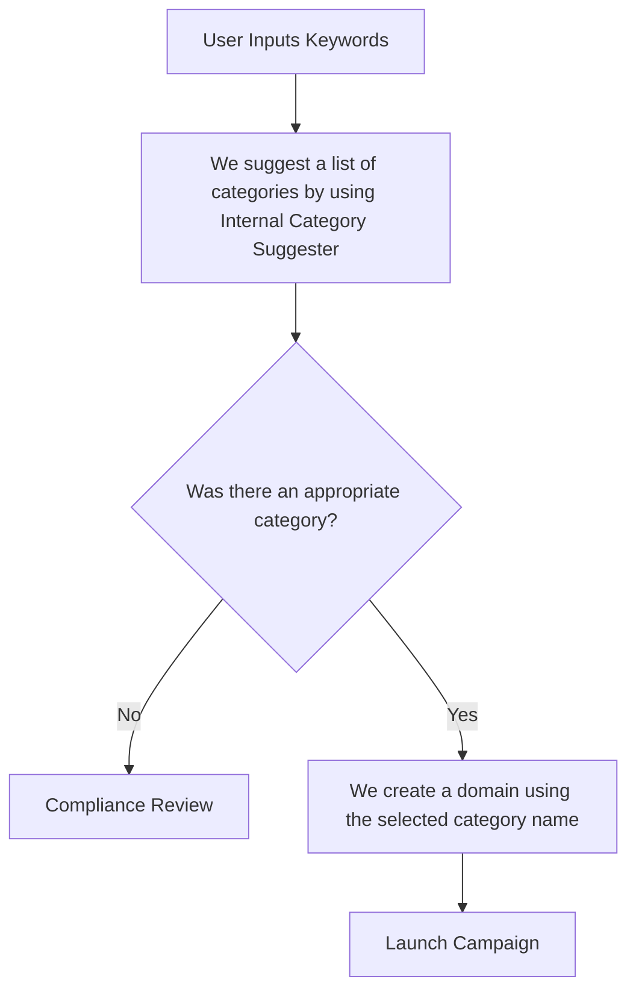

# Campaign Wizard Revamp Roadmap
## Generic flow

## Roadmap
#### 1. Fix Generic Non-Primary Categories [Melanie, Vadim]

#### 2. Internal Suggester [Vadim]
1. Make a decision about a translator to use.
2. Integrate the translator into the Semantic Processor.
3. Implement a module that calculates embeddings for a list of input keywords and returns a list of suggestions.

#### 3. Campaign Creation Adjustments [Vadim, Raj]
*In the new version, users no longer control the domain creation process. It is handled automatically.*
1. Generate a domain name based on the category name.
2. Register the domain.

#### 4. Campaign Wizard New API [Raj, Vadim]
1. `POST: submit-keywords` – Stores keywords, `creating_campaign_uuid`, and categories in the Redis cache (approx. 60 minutes?).
2. `GET: get-meta-data` – Retrieves the necessary metadata required to create a campaign.
3. `POST: create-campaign` – Includes extra parameters: `creating_campaign_uuid` and `suggested_category_uuid` (optional). If `suggested_category_uuid` is null, a record is created in the `CampaignWizardRequests` table.

#### 5. Campaign Wizard Frontend Adjustments [Mark, Nathan, Vadim]
*Reorganizing Campaign Wizard UI sections.*

**Before:**
- *Campaign Meta Information*
- **Domain**
- *Monetization*
- **Keywords**
- *Advanced*  

**After:**
- **Keywords → Category**
- *Campaign Meta Information*
- *Monetization*
- *Advanced*

#### 6. Campaigns Compliance Review [Vadim]
1. Implement a model to store all campaign creation data if the user cannot select a proper category.
2. Implement an endpoint to save campaign requests, with an option to send a notification for new requests.
3. Implement an endpoint to retrieve requests.
4. Develop a dashboard to display requests.
5. Integrate a feature from Category Manager to create a category.
6. Integrate a feature to launch campaigns, including domain registration.
Send an email to the Campaign Creator upon launch?
